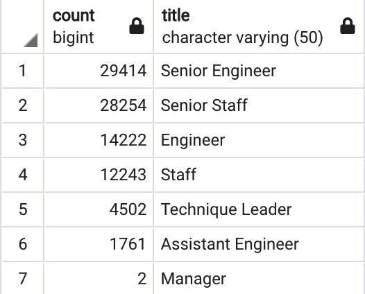
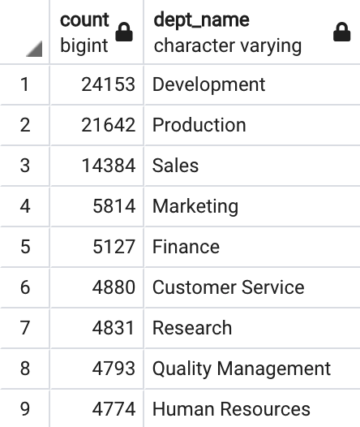
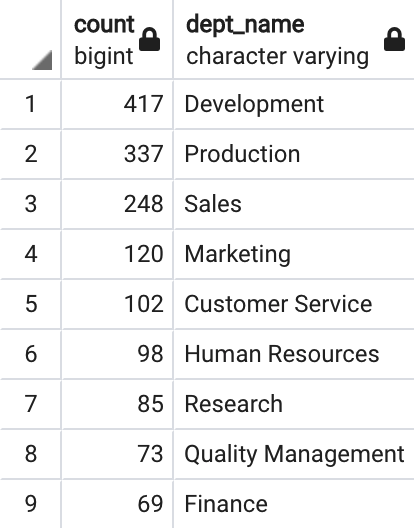

# Pewlett-Hackard-Analysis

## Overview of Project

In this project, Pewlett Hackard which is a large company that has been boasting several thousand employees is looking toward the future for having a plan ready in hand for staff loss as baby boomers are beginning to retire at a rapid.

### Purpose

The purpose of this project is to assist Bobby who is an up and coming HR analyst of Pewlett Hackard to complete building an employee database and help prepare Bobby's manager for the "silver tsunami" as many current employees are reaching retirement age. As a result, with the use of SQL queries and knowledge of data modeling, engineering and analysis skills two technical analysis are required to be carried out for Pwelett Hackard to complete their employee database. These two technical analysis are as follows:

- Determining the number of retiring employees per title.
- Identifying employees who are eligible to participate for the mentorship program.

## Results

This section of the report focuses on the aforementioned technical analysis results achieved and displayed in form of tables using SQL queries constructed.

### Number of Retiring Employees by Title

In this section of the project, retirement titles table was created initially holding the titles of current employees of Pewlett Hackard who were born between January 1, 1952 and December 31, 1955. Since some employees had multiple titles in the database **DISTINCT ON** statement was then used for creating a table containing only the most recent titles of the employees as depicted in the image below.
 

After achieveing the unique titles table, **COUNT()** function was used for creating the final table that had the number of retirement ready employees by most recent job title as demonstrated in the figure below.

Looking at the figure illustarted above, the following results can be observed:

- A total of **90,398** employees are eligible for retirement which means Pewlett Hackard has to spend lots of time and effort in filling those vacancies.

- Majority of employees are retiring from the main key titles of the company in terms **Senior Engineers** and **Senior Staffs**. In other words, about **64%** of retiring employees are having senior titles. Thus, recuriting team of Pewlett Hackard should definitely take an early step in having those positions filled again since a signifigance portion the company is losing its valuable portion.

- Only two employees are retiring from the management title which would be a positive point for Pewlett Hackard as they are highly needed in helping the company continue running and being financially stable.

### Mentorship Eligible Employees

In this section of the report mentorship-eligibility table was created holding the data on current empployees who were born between January 1, 1965 and December 31, 1965 as demonstarted in the figure below.

Looking at the mentorship eligibility table, the following was observed:

- Majority of employees who are eligibale for mentorship are having senior titles which is definitely one of the most important titles in mentoring the next counseling of Pewlett Hackard employees.

## Summary

Pewlett Hackard should be prepared for the coming "silver tsunami" as the baby boomers are reaching their senior years and hence becoming eligibale for retirement. As a result of this, additional tables were created using SQL quesries for providing more insight into the upcoming "silver tsunami".

### Number of Roles to be Filled

Table displayed below demonstartes the number of roles that is needed to be filled per department as the "silver tsunami" begins to make impact. As it can be seen total of **90,398** roles are required to get filled as soon as the employees retire where bulk of retiring employees are from the Development and Production departments. As a result of this, Pewlett Hackard will be having significantly large number of vacancies soon and this requires a lot of hard work and time to be able to get enough work force on time and fill those roles again. Hence, it is recommended that Pewlett Hackard retructure the company or transfere some of the roles to existing staff to overcome the challenge of looking for employees and not needing as many employees as before to continue their operation without facing a down time.

### Retirement-ready Mentors

Figure below depicts the retirement-ready employees table by department who are eligibale to mentor the next generation of Pewlett Hackard. As it is evident from the table, total of **1,549** qualified retirement-ready employees exits in the departments. Hence, there would not be enough number of qualified mentors for the next generation of Pewlett Hackard employees as they are very few comparing to the number of employees who are retiring. However, if Pewlett Hackard attempts to reduce the number of employees needed in the future and fills less percentage of vacanies then this would increase the chance of having enough mentors for the future generation of employees.

