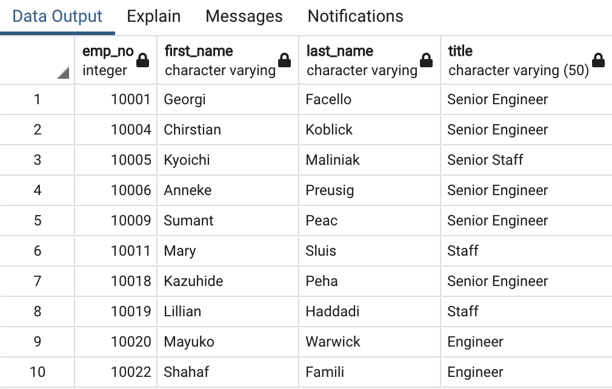
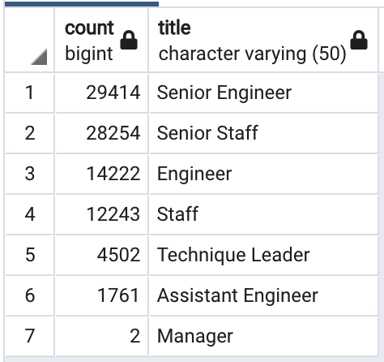
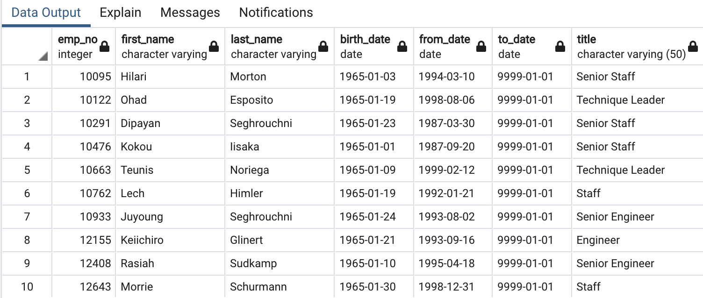
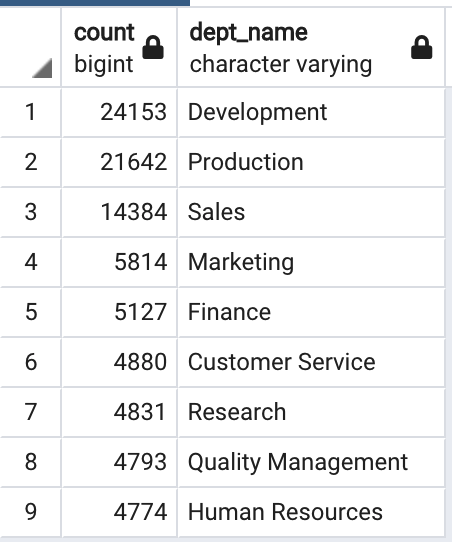
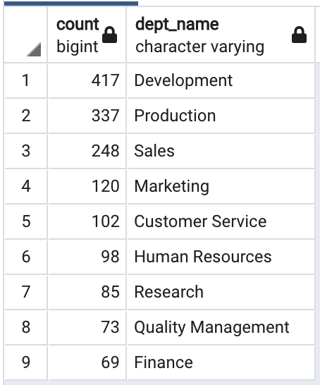

# Pewlett-Hackard-Analysis

## Overview of Project

In this project, Pewlett Hackard which is a large company that has been boasting several thousand employees is looking toward the future for having a plan ready in hand for staff loss as baby boomers are beginning to retire at a rapid rate.

### Purpose

The purpose of this project is to assist Bobby, who is an up and coming HR analyst of Pewlett Hackard, to complete building an employee database so that Pewlett Hackard is prepared for "silver tsunami" as many current employees are reaching retirement age. Therefore, using SQL queries, knowledge of data modeling, engineering and analytical skills two technical analysis are required to be carried out for completing the employee database of Pewlett Hackard. These two technical analysis are as follows:

- Determining the number of retiring employees per title.
- Identifying employees who are eligible to participate for the mentorship program.

## Results

This section of the report focuses on the aforementioned technical analysis results which are achieved and displayed in form of tables using the constructed SQL queries.

### Number of Retiring Employees by Title

In this section of the report, retirement title table was created initially holding the titles of current employees at Pewlett Hackard who were born between January 1, 1952 and December 31, 1955. Since some employees had multiple titles in the database due to promotion, **DISTINCT ON** statement was then used for creating a table containing only the most recent titles of the employees as depicted in the figure below.
 

After achieving the unique titles table, **COUNT()** function was used for creating the final table that had the number of retirement ready employees by their most recent job title as demonstrated in the figure below.
 

Looking at the figure illustrated above, the following results can be observed:

- A total of **90,398** employees are eligible for retirement which means Pewlett Hackard has to spend lots of time and effort in filling those vacancies.

- Majority of employees are retiring from the main key titles of the company in terms of **Senior Engineers** and **Senior Staffs**. In other words, about **64%** of retiring employees are having senior titles. Thus, the recruiting team of Pewlett Hackard should definitely take an early step in having those positions filled again when employees are about to retire since a  valuable portion of the company is going to be vacant.

- Only two employees are retiring from the management title which would be a positive point for Pewlett Hackard as managers are highly needed in helping the company continue running and being financially stable specially when there will be shortage of work force.

### Mentorship Eligible Employees

In this section of the report mentorship-eligibility table was created which holds the data on current employees who were born between January 1, 1965 and December 31, 1965 as demonstrated in the figure below.

Looking at the mentorship eligibility table, the following was observed:

- Majority of employees who are eligible for mentorship are having senior titles which is definitely one of the most important titles in counseling the next generation of Pewlett Hackard employees.

## Summary

Pewlett Hackard should be prepared for the coming "silver tsunami" as  baby boomers are reaching their senior years and hence becoming eligible for retirement. As a result of this, additional tables were created using SQL queries for providing more insights into the upcoming "silver tsunami".

### Number of Roles to be Filled

Table displayed below demonstrates the number of roles that are required to be filled per department as the "silver tsunami" begins to make an impact. As it can be seen a total of **90,398** roles are required to get filled as soon as the employees retire, in which bulk of retiring employees are from the Development and Production departments. 

As a result of this, Pewlett Hackard will be having significantly large number of vacancies soon and this requires a lot of effort to get enough work force on time and fill those roles again. Hence, it is recommended that Pewlett Hackard restructures the company departments or transfer some of the roles to the existing staff to overcome the challenge of looking for employees and not requiring as many employees to be able to continue their operation without facing a down time.
 

### Retirement-ready Mentors

Table below depicts the retirement-ready employees by department who are eligible to mentor the next generation of Pewlett Hackard employees. As it is evident from the table, total of **1,549** qualified retirement-ready employees exist in the departments. Hence, there would not be enough number of qualified mentors for the next generation as they are very few comparing to the number of employees who are retiring. However, if Pewlett Hackard attempts to reduce the number of employees needed in the future and fills less percentage of vacancies then this might increase the chance of having enough mentors for the future generation of employees.
 

